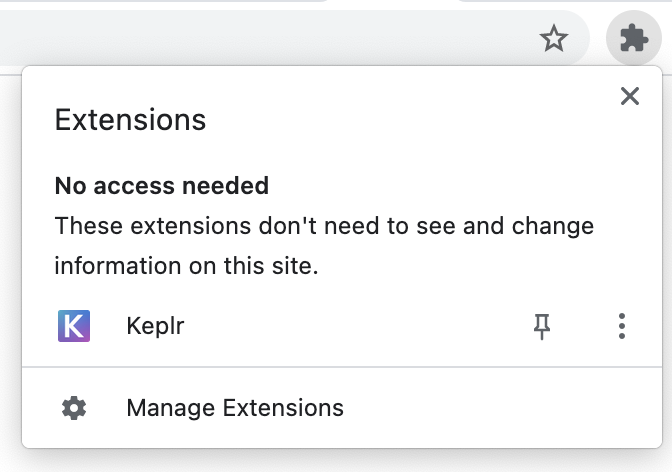
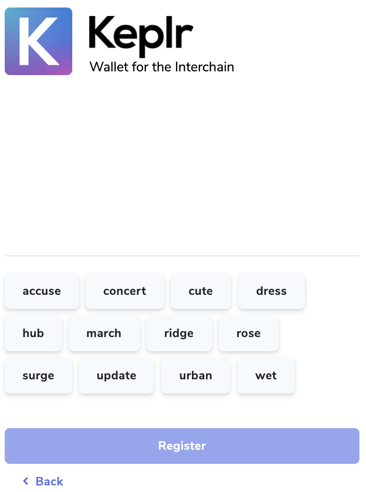

# Getting ATOM & Staking

The [Cosmos Hub](https://hub.cosmos.network) is the first among equals of Cosmos blockchains. The ATOM is the native token of the Cosmos Hub, also called the staking token. You need some ATOM to be able to transact on the Cosmos Hub, or to participate in the proof-of-stake consensus. Because of its usefulness, there are markets that determine the ATOM price in common currencies.

So let's get our feet wet. We are going to:

1. get some ATOM,
2. and participate in the consensus, thereby earning yield on our ATOMs while sleeping, or studying further.

We cover all the main concepts in the next chapter. For now, a surface-level understanding will get you through.

The simple step of _get some ATOM_ hides multiple steps:

1. Install a wallet application, and configure it safely. We will use Keplr.
2. Buy some ATOM on an exchange, and transfer them to your wallet.

Let's get started.

## Set up Keplr

First the easiest part, open Google Chrome on your computer and go to the [Keplr extension](https://chrome.google.com/webstore/detail/keplr/dmkamcknogkgcdfhhbddcghachkejeap) page. Alternatively, you could search by yourself for Keplr in the [Chrome extensions store](https://chrome.google.com/webstore/search/Keplr). Indeed it is always good practice to be a bit suspicious of links to wallets as sometimes fraudulent ones are published in order to steal from you. Good thing, Keplr is mentioned, and linked, [here](https://cosmos.network/ecosystem/wallets), lending it some credibility.

When it is installed, it should be available in your list of extensions when you click on the icon in the top-right corner of Chrome:

You can go ahead and pin it if you want.

<HighlightBox type="warn">

When you own ATOM with Keplr, **you are in charge**. For real. There is no one you can call because _you forgot your password_, _your hard-disk crashed_, or _you sent to the wrong address_.

In the jargon, Keplr is a non-custodial wallet.

</HighlightBox>

Now, with the Keplr extension installed and the above warning, let's create a new account. Click on Keplr and the following page should open:

Click _Create new account_. The page that opens offers you a mnemonic and asks you for a password. Because _you are in charge_, it is important to understand the following points:

1. Whoever knows the mnemonic seed has access to **all** the assets in this wallet as easily as you with your own wallet. This means that:
    1. Nobody else should be looking at your screen right now. If that is not the case, click _Back_.
    2. You should share it only with trusted partners, if at all. An exchange, a proof-of-stake validator or another blockchain service is _not_ a trusted partner.
    3. You should save it in safe places, typically on paper, so that you can import it back in this or another wallet at a later date.
2. Keplr will save your seed on disk but encrypted.
3. Keplr is asking you for the encryption password.
    1. It should be a strong password.
    2. You should save it too.
    3. Keplr will ask you for it every first time you open it and for important actions.
4. If your computer or the encrypted mnemonic seed file is stolen, your wallet assets are as protected as your password is strong.
5. If you are starting now with weak security because you plan on keeping only very little value in your wallet, consider creating a new mnemonic and password in the future when you plan on holding more value. In effect, as if your _weaker_ wallet had been compromised.

Forewarned is forearmed. When you are ready, click on _Next_.

If you saved your seed, you should be able to complete the next step, where you need to click on each word in the right order.

When done:

After clicking _Register_, it says you are all set:

You can click on the extension icon again and see that you hold zero ATOMs in Cosmos, and that you have a first public address of the form `cosmos1...`. You have zero assets in the other supported networks either, if you care to click on the drop-down labeled _Cosmos_ at the top.

You can also open the [Keplr dashboard](https://wallet.keplr.app/#/dashboard) page, which interfaces with the extension.

<HighlightBox type="tip">

Now would be a good time for you to save your mnemonic and password safely before you put valuables in your wallet.

</HighlightBox>

## Fill in Keplr
