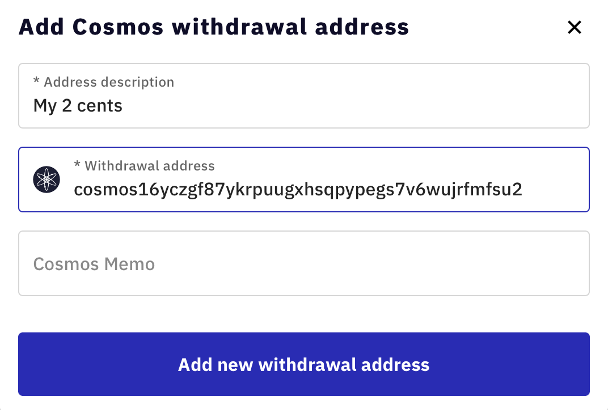
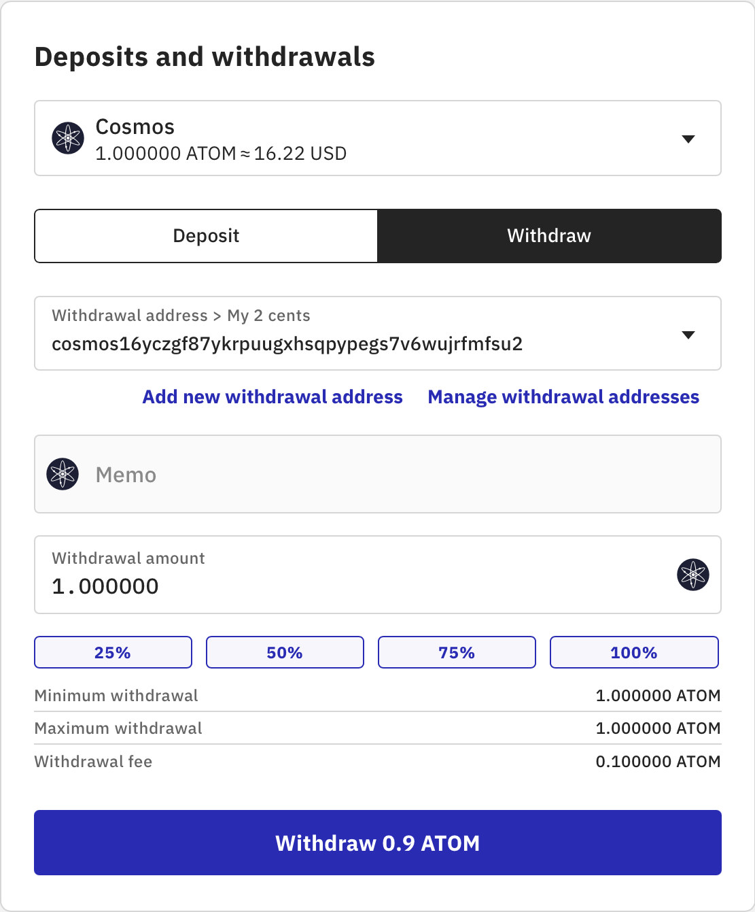
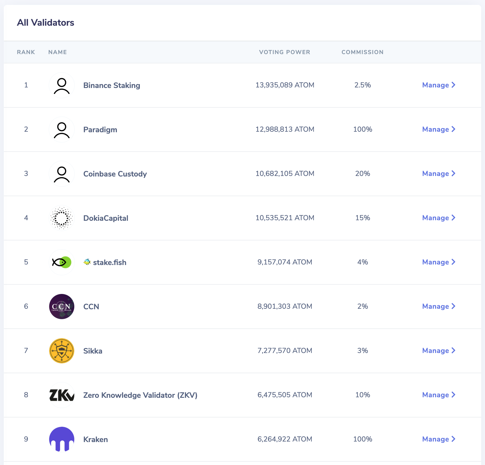

# Getting ATOM & Staking

<!--

This content could be linked to from https://cosmos.network/learn/get-atom as a step-by-step.

-->

The [Cosmos Hub](https://hub.cosmos.network) is the first among equals of Cosmos blockchains. **ATOM** is the **native token** of the Cosmos Hub, also referred to as the staking token. You need some ATOM to be able to transact on the Cosmos Hub, or to participate in the Proof-of-Stake consensus. The ATOM price in common currencies is determined by markets.

There is no limit on the supply of ATOM tokens. Based on the number of ATOM being staked, the network adjusts the amount of tokens created. In 2020, the annual inflation rate varied between 7% and 20%.

*Why does the Cosmos Hub need a native token?*

BFT networks are financially constrained, i.e. game-theoretic, systems. As such, they require a **unit of value**. To date, most, if not all, public blockchains have relied on a native token. Blockchains implementing game-theoretic mechanisms can proceed without a native token by instead relying:

* On an alternative representation of value, or 
* On authority or other alternatives to game-theoretic systems of rewards and penalties.

ATOM is exactly that unit of value for the Cosmos ecosystem and secures the Hub's valuable interchain services (i.e. interoperability). It is essential for transaction finalization because BFT relies on the possibility of achieving a quorum, as well as a financial reward and penalty system to establish strong economic incentives for validators to act in the network's benefit.

***What can token holders do with ATOM?* Basically, they can hold, spend, send, or stake ATOM tokens.**

So, let's get our feet wet. We are going to:

1. Get some ATOM;
2. Participate in the consensus, thereby earning yield on our ATOM tokens while sleeping, eating, or studying further.

<HighlightBox type="info">

In the next chapter, we cover all the main concepts in a deep dive. For now, you will get through with a surface-level understanding.

</HighlightBox>

Behind the simple step of _getting some ATOM_ multiple steps hide:

1. Install a wallet application and configure it safely. We will use [Keplr](https://keplr.app/);
2. Buy some ATOM on an exchange and transfer them to your wallet.

Let's get started!

## Setting Up Keplr

First the easiest part, open Google Chrome on your computer and go to the [Keplr extension](https://chrome.google.com/webstore/detail/keplr/dmkamcknogkgcdfhhbddcghachkejeap) page. Alternatively, you could search by yourself for Keplr in the [Chrome extensions store](https://chrome.google.com/webstore/search/Keplr).

<HighlightBox type="warn">

Indeed, it is always good practice to be a bit suspicious of links to wallets as sometimes fraudulent ones are published to steal from you. Good thing, Keplr is mentioned, and linked, [here](https://cosmos.network/ecosystem/wallets), lending it some credibility.

</HighlightBox>

When it is installed, it should be available in your list of extensions when you click on the icon in the top-right corner of Chrome:

You can go ahead and pin it if you want.

<HighlightBox type="warn">

When you own ATOM with Keplr, **you are in charge**. For real. There is no one you can call because _you forgot your password_, _your hard disk crashed_, or _you sent tokens to the wrong address_.

In the jargon, Keplr is a **non-custodial wallet**. This means you have sole control of your private keys, which in turn control your digital asset and prove ownership - With a custodial wallet, another party controls your keys, i.e. holds your digital assets in custody.

</HighlightBox>

Now, with the Keplr extension installed and the above warning, let's create a new account. Click on Keplr and the following page should open:

Click _Create new account_. The page that opens offers you a mnemonic and asks you for a password. Because **you are in charge**, it is important to understand the following points:

1. Whoever knows the **mnemonic seed** has access to **all** the assets in this wallet as easily as you with your own wallet. This means that:
    * Nobody else should be looking at your screen right now. If that is not the case, click _Back_.
    * You should share it only with trusted partners, if at all. An exchange, a proof-of-stake validator, another blockchain service, or "someone from Cosmos" on the phone are _not_ trusted partners.
    * You should save it in safe places, typically on paper, so that you can import it back in this or another wallet at a later date.
2. Keplr will **save your seed on disk** but encrypted.
3. Keplr will ask you for the **encryption password**:
    * It should be a strong password.
    * You should save it too.
    * Keplr will ask you for it every first time you open the wallet and for important actions.
4. If your computer or the encrypted mnemonic seed file is stolen, your wallet's assets are as protected as your password is strong.
5. If you are starting now with weak security because you plan on keeping only very little value in your wallet, consider creating a new mnemonic and password in the future when you plan on holding more value. In effect, act as if your _weaker_ wallet had been compromised, and as if a thief is waiting for you to put more in it.

Forewarned is forearmed. When you are ready, click on _Next_.

If you saved your seed, you should be able to complete the next step, where you need to click on each word in the right order.

When done, you should see:

After clicking _Register_, it says you are all set:

You can click on the extension icon again and see that you hold **zero ATOM tokens** in Cosmos, and that you have a first public address of the form `cosmos1...`. If you care to click on yhe drop-down labeled _Cosmos_, you can see that you have zero assets in the other supported networks either.

A note on your **address**: As with street addresses, it is ok for others to know it, as it allows others to send you ATOM or other tokens of the Cosmos ecosystem.

<HighlightBox type="tip">

Now would be a good time for you to save your mnemonic and password safely, before you put valuables in your wallet.

</HighlightBox>

<HighlightBox type="info">

You can also open the [Keplr dashboard](https://wallet.keplr.app/#/dashboard) page, which interfaces with the extension. Take note of how the dashboard at this address is a web page loaded from a website and as such is not a trusted partner. In fact, it will never ask you for your mnemonic or your password.

</HighlightBox>

## Purchase 1 ATOM

How you purchase an ATOM is highly dependent on what your preferences are. Generally speaking, you need to get on an exchange and for instance, purchase 1 ATOM, which is worth 16 USD at the time of writing. You can get any amount you wish, although do not get less than 0.3 ATOM so that it does not get all consumed in transaction fees before the end of this exercise.

As found [here](https://cosmos.network/learn/get-atom), [this](https://messari.io/asset/cosmos/markets) is a **list of exchanges** that are known by Cosmos to carry ATOM.

When you are done, your account on the exchange should show you that you **own 1 ATOM**. Actually, you do not own it as you would if the token were in your Keplr wallet. It is the exchange that owns it and assures you that they will send it to you when you ask them to. In the jargon, the exchange acts like a custodial wallet.

## Withdraw Your ATOM

Let's see if the exchange makes good on their promise to send the ATOM to you.

Your exchange has a **withdrawal function** that allows you to send your ATOM anywhere, including to your Keplr wallet. Let's set this up.

You need your wallet address. Since it is very long, you should avoid typing it by hand but instead copy it in the clipboard by clicking on it in Keplr:

Now go back to your exchange, paste this address where asked, **confirm** that it looks identical to the original you copied, and if necessary, proceed with the confirmation the exchange requests:

When it is set, you ask the exchange to withdraw.

Take note of the **transaction fee** taken by the exchange. It is much higher than a realistic transaction fee would have been, had you done it yourself within your own wallet:

If all went well, you should see your new asset inside your Keplr wallet after a couple minutes:

**Congratulations!** You now own just short of 1 ATOM. Remember, **you** are really in charge, so check again that your mnemonic and password are saved properly.

You can see the same if you open the [wallet page](https://wallet.keplr.app/#/dashboard).

<HighlightBox type="info">

By the way, you can look at your address within a public explorer like [mintscan.io](https://mintscan.io).

</HighlightBox>

In this wallet page, you can see a small link that leads you to your address page:

There, you can see the transaction that originated from the exchange's wallet:

Note in particular how the exchange charged you, say 0.1 ATOM, i.e. way more than it actually costed, here 0.0003 ATOM.

## Stake Your ATOM

Every ATOM holder can contribute to the Cosmos Hub's security by staking ATOM. **Staking**. The token holder locks its ATOM tokens. In exchange, the token holder **receives rewards**, in the form of newly minted ATOM tokens, and a part of the transaction fees collected. Each validator receives rewards based on the number of tokens they stake. Token holders, that delegated their ATOM, receive a percentage of the validator's reward in exchange.

When one stakes ATOM, one can participate in the voting of Cosmos Hub network upgrades - **each vote is proportional to the amount of staked ATOM**. Whereas any ATOM holder can **submit a proposal** for upgrades. Only proposals with a minimum deposit are eligible for voting - the current minimum is 512 ATOM tokens. The complete deposit does not have to come from a single token holder or the proposal submitter but can be crowdfunded by other token holders. With given sufficient deposit, a 14-day voting period begins. All ATOM stakers can vote on an active proposal. In case a token holder does not vote, the token holder inherits the validator's vote, the token holder delegated to, as a default.

In PoS networks, token holders can lock their token for a period of time to obtain voting powers, this is called **bonding**. Bonded tokens give the right to rewards and are exposed to slashing, a process in which, after a validator fraud reporting, delegated bonded tokens are destroyed.

### Let's Dive Right In

Now, your 0.9 ATOM is available. It is sitting there in your wallet, and it will stay there forever. It will also stay at 0.9 ATOM forever unless you use it for something.

*What about participating in the security of the Cosmos Hub blockchain?* You can do this by **delegating a stake**, i.e. some of your ATOM, to a network validator. In exchange for this service, validators receive block rewards, and share the rewards with their delegators too, minus their own commission. Your modest delegated stake could award you a modest share of a validator's rewards.

*Why stake ATOM?*

* The benefit of it is that, unlike a bank, which holds your assets in a custodial wallet, when you delegate your ATOM, you remain in charge of your ATOM, so the validator does not have access to your assets. Think of your stake as a weighted vote of confidence.
* A non-zero risk is that the validator you chose behaves incorrectly, or even maliciously, which exposes you proportionally to the same protocol penalties as the faulty validator.
* Also keep in mind that the amount you delegate is locked away, and you would need 21 days to have access to it again, should you so decide.

Let's **find a validator and delegate to it**. Past performance is no indicator of future performance, but in our case, we are going to believe it is.

So, click the _Stake_ button in Keplr. You are presented with a **list of validators**:

Right away you can discard the validators that keep 100% of the rewards for themselves, as they work for the custodial wallets they keep on behalf of their customers.

Pick one validator that you like and click _Manage_. Then you should see a link where you can learn more about this validator. Additionally, you can see more information about each validator on [this page](https://www.mintscan.io/cosmos/validators) of Mintscan.

Pay attention to the **uptime**, as a missed block would cost you in penalties.

A validator can have a small or a large **voting power**. **The larger the voting power, the more often the validator is tasked with issuing a block.** The effect that voting power has on you is that:

* If your chosen validator has a large voting power, your rewards will come in frequently, e.g. every minute, but in small numbers;
* If your chosen validator has a small voting power, your rewards will not come in frequently, e.g. every hour, but in large numbers.

However, over the long run, you should get the same amount. What matters is the **size of your stake**. 

If you like what you see, it is time to click _Delegate_ and put in a sum here.

<HighlightBox type="tip">

Do not delegate all that you own because you still need a fraction of ATOM to send the delegate transaction, and further fractions in the future to either undelegate or claim your rewards.

</HighlightBox>

Let's pick 0.8 ATOM and click _Delegate_.

This **delegation** is an important action. It is in fact the first action you take with your private key. It is therefore natural and welcome that a window pops up to confirm with you that it is indeed what you intended. Every time an application asks Keplr to do an important action, Keplr will confirm with you.

You do not need this delegate transaction to be confirmed quickly, so go and choose the low end of transaction fees. Click _Approve_. The transaction should not take longer than a couple minutes to be confirmed.

When it is **confirmed**, your pending staking rewards start accruing. Not that fast because you delegated only 0.8 ATOM, and they only accrue when your chosen validator issues a block. After perhaps 20 minutes, you should see something like this:

Your rewards are said to be pending because you need to **claim them** before you get them for real. Of course, the claim transaction has its own fees, so it is best for you to wait that your rewards exceed the transaction fees before submitting any claim transaction.

This completes this exercise. You got yourself set up to participate in the Cosmos Hub network and even participate in its security. Your stake is working for you as you continue your exploration into Cosmos.
