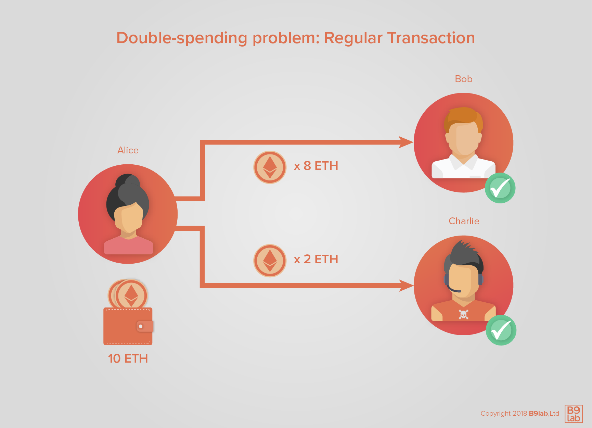
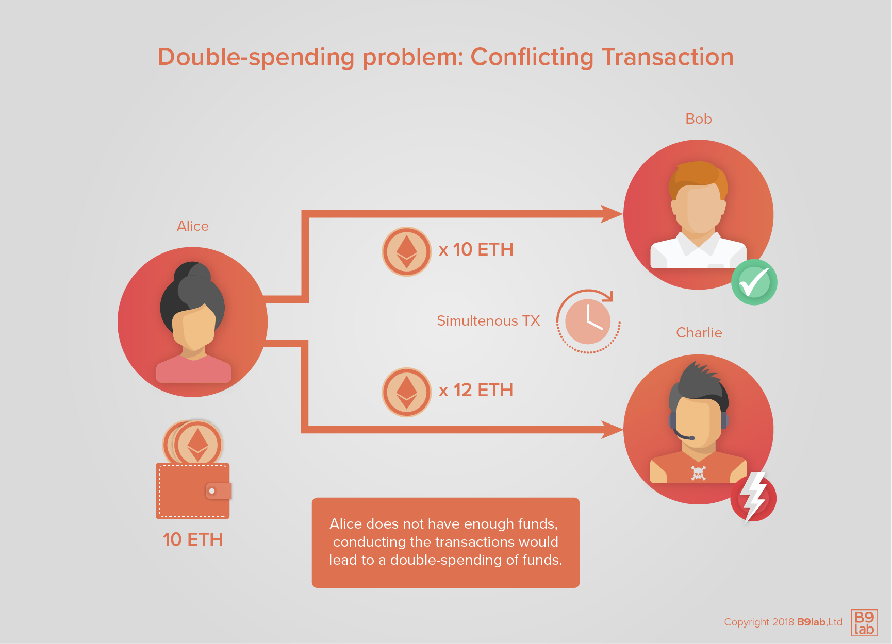
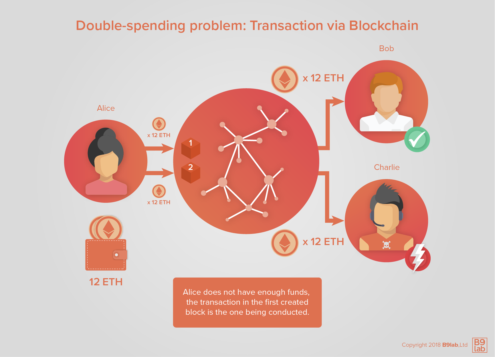

# Introduction - Blockchain Technology

There are many different ways to understand blockchain technology and grasp all the Cosmos ecosystem provides. In order to give you a thorough understanding and a complete view, we will not restrict ourselves to one single definition and understanding. Instead, we will present you with a vast spectrum of conceptualisations throughout the first chapter.

Let us start with an overall introduction to this exciting and sometimes intangible technology everybody is talking about.

**Blockchain** is a complex and rapidly evolving technology. It took up many bright minds many years of development plus a combination of advances in cryptography, distributed computing, and economics to create the current technology. Grasping blockchain requires serious effort.

The blockchain journey begins with a problem...the **double-spending problem**.

The double-spending problem refers to a potential flaw in a cryptocurrency and other digital cash schemes: _what if the same single digital token can be spent more than once regardless of the available account balance._

Satoshi Nakamoto, whose identity remains shrouded in mystery, published his seminal whitepaper [*Bitcoin: A Peer-to-Peer Electronic Cash System*](https://bitcoin.org/bitcoin.pdf) in October 2008.

<HighlightBox type="tip">

[Satoshi Nakamoto: Bitcoin: A Peer-to-Peer Electronic Cash System](https://bitcoin.org/bitcoin.pdf) - it is a fairly straightforward paper. Feel free to have a look at the first whitepaper for a blockchain protocol.

</HighlightBox>

To solve this problem, Satoshi Nakamoto presented a **solution to the double-spending problem** for digital currencies by giving the first working example of a blockchain application in the form of a simple implementation called **Bitcoin**. In doing so, he revealed the underlying technology known as blockchain.

Bitcoin has gained widespread attention since then. The world has discovered the underlying technology of Bitcoin and its usefulness across many contexts and use case implementations.

## What does blockchain solve?

Digital artefacts can be copied with ease. This presents obvious problems if we want digital artefacts to represent assets with value. When considering digital cash schemes, a more pressing issue is the possibility of spending a digital token more than once. _What prevents someone from making copies and spending the same money twice?_

In the **current economic system**, currency systems rely on **central authorities** such as central banks, **third parties that manage and control financial transactions**, and **physical safeguards on banknotes** to prevent double-spending and counterfeiting. A third party such as a bank, credit card company, or payment service is used as a **trusted ledger keeper**. They all keep digital ledgers to avoid double-spending. Consequently, it is generally not possible for two parties to exchange value online without involving a trusted third party to handle the settlement process.



Things are different in the digital world. To gain a clear grasp of the double-spending problem with digital currencies, consider the following:

* A malicious Alice sends digital coins to Bob in exchange for goods or services.
* Alice sends the same coins to Charlie in exchange for other goods or services.
* Both Bob and Charlie deliver the goods or services but only one of them will be able to spend the received coins.



Double-spending is important for digital tokens because they could theoretically be spent more than once. Double-spending refers in the blockchain context to a situation in which **one** token is spent **twice or more** times.

The double-spending problem in blockchain technology should be clearly distinguished from double-spending problems related to duplication and/or falsification, which can lead to inflation, currency devaluation, and distrust among currency holders. Problems from duplication and/or falsification are more related to digital cash systems and solved with a trusted central authority.



At a high level, blockchain solves the problem by **replacing the trusted central ledger-keeper with a network of ledger-keepers**. Each member of the network has an exact replica of the ledger and no one can append the ledger without achieving network consensus about it first, which requires at least a majority of nodes agreeing on the state of the ledger.

It is as though each transaction is observed by a *large crowd of witnesses* who reach consensus about proposed changes. They also prohibit events that should not occur, such as spending non-existent funds twice, i.e. double-spending. 

<HighlightBox type="info">

If the concept of consensus in blockchain is something completely new to you, please do not worry: we will dive deeper into consensus and consensus algorithms used in blockchain protocols in this chapter's section [Consensus](./consensus.md).

</HighlightBox>

Bitcoin and its underlying technology convincingly demonstrate that a network of participants that do not necessarily trust each other, can form a consensus about the validity of a transaction, its history, and the resulting state of the ledger. This is interesting because simple ledgers of account balances and simple protocols for moving funds are far from the only use cases for shared data consensus.

## How does blockchain work?

Imagine you want to **retain and monitor changes to a file**, for example a log file. Now, imagine you also want a verifiable, unbroken history of all changes ever made to the file. How can you proceed?

A well-understood solution is to use cryptographic [hash functions](https://en.wikipedia.org/wiki/Cryptographic_hash_function). A hash can be used to prove an input exactly matches the original, but the original cannot be reconstructed from a hash.

The ideal cryptographic hash function has **five main properties**:

* **Deterministic:** the same message always results in the same hash;
* **Fast:** the hash value for any given message is computed quickly;
* **Resistant:** it is infeasible to generate a message from its hash value except by trying all possible messages;
* **Avalanche effect:** a small change to a message should change the hash value so extensively that the new hash value appears uncorrelated with the old hash value;
* **Unique:** it is infeasible to find two different messages with the same hash value.

<HighlightBox type="tip">

You can see hashing in action to get the feel for it on the [OnlineMD5 website](http://onlinemd5.com/). As you type in the text box the hash updates automatically. Even a minuscule change to the input creates a completely different hash.

</HighlightBox>

There are many different hashing algorithms. Each algorithm consistently produces hashes of the same size regardless of the size of the input.

<HighlightBox type="tip">

You can find a more detailed explanation of hash functions in the [Cryptographic Fundamentals section of this chapter](./cryptographic-fundamentals.md).

</HighlightBox>

What about subsequent changes to the file?

Suppose new entries will only be appended to the end of the file.

You can make a rule stating that in addition to the new content, the previous hash will also be an input of the next hash. The (pseudo-)code would look like this: 

```javascript
version2Hash = hash(version2Changes + version1Hash)
```

The above allows to examine proposed changes and confirm the previous file, while making sure subsequent changes are accurately disclosed. With the method presented, it is possible to create a chain of hashes and with it a cryptographic secure history by repeating it for all subsequent versions.

Since knowing the current hash of the latest valid version is a required input to the next version's hash function, it is impossible to generate a new valid version that precedes it. This means changes must be appended to a previous valid version. Then, any version of the file contents can be shown to be part of an **unbroken chain of changes** all the way back to the file's inception. This is pure mathematics. Any deviance from the system, meaning a hash that does not compute as expected, proves a break in the history and is therefore invalid.

Blockchain functions in a similar way. **Blocks of transactions** are appended using hashes of previous blocks as inputs into hashes of subsequent blocks. Any participant can quickly verify an unbroken chain of blocks and with it the **correct order**.


In blockchain, cryptographic hash functions are instrumental to empower participants and assure them that they possess an undistorted history of everything.

## Why is order so important in blockchain?

**Blocks** are _logical units that wrap up **a set of transactions in a specific order**_. While the implementation details are somewhat more subtle, for now, think of a block as the set of transactions that occurred during a set time interval and in a specific order.

Transaction ordering is surprisingly challenging in a distributed system due to design goals and constraints. Looking closer at Bitcoin and its solution helps understand how order and consensus about order is possible in a distributed network:

* **Everyone** has a little bit of authority. For example, all nodes can propose transactions and then announce that information to other nodes.
* No one's clock is considered more authoritative than anyone else's clock, so blockchain is a distributed **timestamp** server **without a central network time**.
* Theoretically, **anyone** can listen to transaction proposals and create a valid block containing an _opinion_ about the correct order of events (transactions).
* Everyone in the network will learn about transaction proposals in a slightly different order due to **physics and network latency**.
 
So how is the **order of transactions** determined?

Even assuming all members of the network mean well and participate honestly, each node will arrive at a slightly different opinion about the ordering of transactions. This is simply a result of network latencies.

Although there is no obvious way to then settle on the correct order, **transaction order must be resolved** because processing transactions out of order would produce non-trivial differences in outcomes. Such a non-trivial difference would be, for example, an instance of double-spending. Without agreement about the transaction order, there can be no agreement about the balances of accounts. Thus, order is essential for the correct functioning of a blockchain like Bitcoin.

## Blockchain as a lottery

The (ledger) **state** with a disambiguated transaction order is called **consensus**. The consensus process happens independently of an authoritative time source in blockchains. Consensus mechanisms established and implemented by protocols are called **consensus algorithms**.

Bitcoin uses a consensus algorithm called **Proof-of-Work** (PoW), which can be (simplistically) thought of as a lottery: the lucky winner gets the privilege of being the authority on one block of transactions. The winning lottery ticket, called the **nonce**, is used as the next input for the hash function. This is easily verifiable for other participants. The lottery winner can generate a block containing a certain transaction order, which is then valid.

<HighlightBox type="info">

In blockchain networks, participants are often referred to with the term **node**.

In general, a node is a _point of connection in a network that serves as a (data) redistribution point or communication endpoint_. Nodes are connected through communication channels that enable them to exchange data and share resources.

</HighlightBox>

It is important to note that a valid block does not mean this block represents some form of absolute "truth". **The "truth" in blockchain is often defined as the longest chain of valid blocks.**

To summaries:

* A valid block is a **well-ordered set of transactions**.
* The block contains the **hash of the previous block**.
* The block includes a "winning lottery ticket", the **nonce**.

A well-ordered set of blocks of well-ordered transactions is in the end a well-ordered set of all transactions.

Other participants recognize this unlikely combination - unlikely because of the probability each participant has of owning the winning lottery ticket. They accept the block as a de facto correct opinion about the order of transactions.

Since **all nodes can verify the chain independently**, the nodesy can proceed on the assumption that all other nodes will eventually come into agreement about the history of everything.

<HighlightBox type="info">

All participants accept the new blocks being created only as long as there is no fork from the main chain - a second chain that split off from the main chain because two or more miners found a block almost at the same time. Thus, both blocks have the same block height and represent competing versions of the "truth". When a fork occurs, the longest chain rule applies to in the end find consensus on the order of transactions and blocks.

</HighlightBox>

## Quick recap

A blockchain starts with the **genesis block**. This is a simple matter of an initialized universe in which nothing has happened yet. Think of it as a pre-Big Bang universe. As soon as the first block of transactions is generated the Big Bang occurs and the universe starts expanding.

The blockchain proceeds by constructing a verifiable and widely agreed history of every transaction that has ever occurred. Nodes have a copy of the present state (ledger) with the ordered history of every single change (the transactions). The history of everything that has ever occurred moves forward in time as "lottery winners" (the nodes) announce new transaction blocks. Each new block must be verified to achieve network consensus.

## About the introduction to blockchain chapter

This chapter is a general introduction to the concept of blockchain. It is not very technical and will reiterate concepts that you might already know. Existing terminology and technologies are repeated because they feed into blockchain technology. Thus, it makes sense from a structural perspective to revisit certain important aspects and understand how they apply to the technology.

In this chapter, we will:

* Briefly describe general concepts of networking to introduce the concept of a ledger and consensus, which are central in blockchain technology;
* Discuss public-key cryptography and how public/private key pairs can be used to encrypt, decrypt, sign, and verify messages;
* Revisit the development of computing over the past decades and how blockchain fits into it;
* Introduce taxonomy, attributes, and concepts related to blockchain technology such as deployment patterns, smart contracts, and the crypto economy.

At the end of this chapter, you can find some [reflection questions](./reflection.md) and a [self-assessment quiz](./self-assessment.md).

Have fun!
