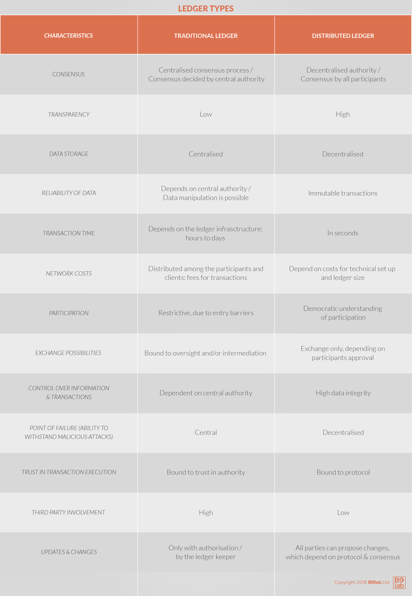
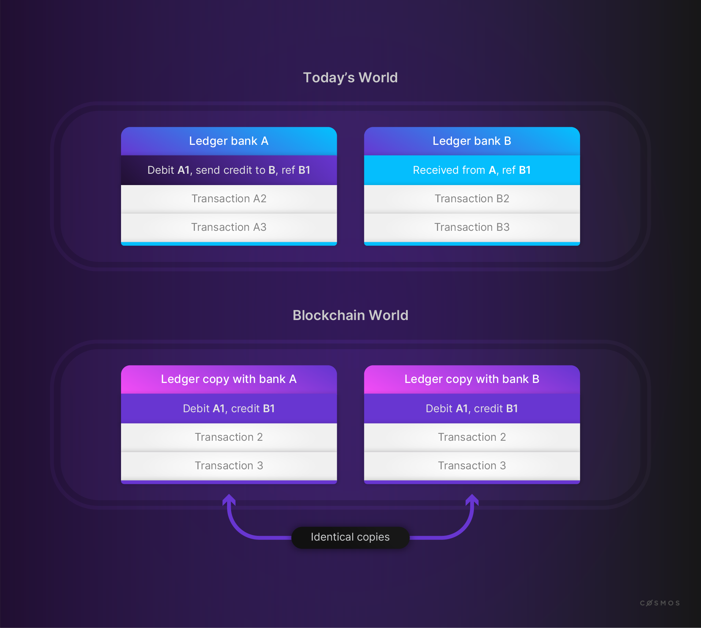

# Ledgers

There are many different ways to look at blockchain technology. To give you a thorough understanding and a complete view, do not restrict yourself to one definition of blockchain but keep in mind the different conceptualizations of the technology.

Let's dive into how blockchain and the concept of a distributed ledger are linked.

<ExpansionPanel title="Open Systems Interconnection model">

The Open Systems Interconnection (OSI) model, developed by the International Organization for Standardization, is a generalized seven-layer architecture concept for communication in a telecommunication or computing system. Each layer represents a certain functionality:

* Layer 1: the physical layer, responsible for the physical connection between devices;
* Layer 2: the data link layer, responsible for the message delivery between nodes;
* Layer 3: the network layer, responsible for data transmission between devices in different networks by dealing with packet routing to determine data routing paths and addressing to identify sender and receiver;
* Layer 4: the transport layer, responsible for end-to-end delivery of messages, acknowledgments if successful data transmissions, and re-transmissions of data in case of errors by relying on services from the network layer and providing services to the application layer;
* Layer 5: the session layer, responsible to establish a connection, maintain a session, and terminating it, as well as for ensuring synchronization with checkpoints;
* Layer 6: the presentation layer, responsible for translation, encryption, decryption, and compression of data;
* Layer 7: the application layer, implemented by the network's application and responsible for interacting directly with the application.

Whereas, layers 1 to 3 are hardware layers, the transport layer (layer 5) is the heart of the OSI, and layers 5 to 7 are software layers.

Want to take a look at the OSI model in more detail? Take a look at this [overview from GeeksforGeeks](https://www.geeksforgeeks.org/layers-of-osi-model/).

</ExpansionPanel>

In the OSI network model fashion, one can break down blockchain technology in the following manner:

As you can see transactions are recorded on the _transaction ledger_. A **ledger** is _a book or file that records and totals economic transactions_.

First, take a look at transactions and then at ledgers to better understand ledgers and their relevance for blockchain technology.

## Transactions and ledgers

A **transaction** is _an **atomic event** which means its components make no sense in isolation_. If the word transaction conjures up a financial transaction in your mind, this is indeed appropriate.

A single transaction might look like this:

* Reduce account A by $10;
* Increase account B by $9;
* Increase account C by $1.

It is easy to understand that this transaction is a payment.

If you were told only "Reduce account A by $10", you would rightfully ask: "Where did those $10 go?". Here, you can see what is meant by transactions being atomic - comes from the Greek word for undividable. You need every component of the transaction to exist for it to make sense and therefore to take place. Otherwise, you are left with the question: "Where did those $10 go?".

If the word transaction reminds you of database management systems, this too is appropriate. Transactions happen in databases too. For instance, technology permitting, a single transaction might look like:

* Charge customer for $10;
* Ship one widget;
* Add one en-route shipment for the customer;
* Reduce widget stock by one.

In the context of blockchain, a transaction is any atomic event that is allowed by the underlying **protocol**. They are recorded as they are proposed by the lottery winner. The order of transactions is extremely important here and is one of the reasons why blockchain protocols are designed the way they are.

To better understand the significance of the ledger order, imagine:

* You have an account balance of "3";
* You transfer "3" to member A and "3" to member B in quick succession.

If the ledger is not **well-ordered**, both transactions could be issued even though your account balance would be insufficient. Well-order of execution prevents double-spending.

To get a picture of the state of accounts at any point, all transactions until that point in time have to be added up. One by one, each transaction record alters the state of the ledger.

Transactions contain an arbitrary set of data depending on the purpose and structure. For instance, financial ledgers usually contain the following data:

* Sender
* Recipient
* Amount
* Credit/debit
* Reference

Processing each transaction in the ledger enables us to derive all kinds of meta-information such as the number of transactions, activity per account, and individual account balances. An account balance like the balance of your bank account is an abstract representation of a list of transactions.

Traditionally ledgers are maintained by a trusted authority called a **ledger keeper**. Ledger keepers include insurance companies, banks, tax collectors, and many other entities.

Carrying out a transaction in a system with trusted authorities entails the following steps:

1. Identify yourself to the ledger keeper.
2. Request data, like your account balance, from the ledger keeper.
3. Request the recording of a new transaction.
4. The ledger keeper checks the validity of the transaction - Do you have sufficient balance? Is your account active or inactive/frozen?
5. The ledger keeper enters the transaction into the ledger and informs other ledger keepers of the transaction if necessary, for example, in the case the transaction's recipient has an account with another bank.
6. The recipient can now identify themselves with their ledger keeper and ascertain their updated balance.

This system works well as long as ledger keepers can be trusted or mechanisms are in place to ensure the ledger keeper's compliance.

The advantages and disadvantages of traditional ledgers compared to decentralized ledgers like blockchains are highly dependent on the degree of centralization of authority.

In a highly centralized traditional ledger, data reliability, information control, execution of transactions, and consensus on transactions depend on the trustworthiness of the central authority. Participation and transaction execution are restricted by oversight and/or intermediation in centralized ledgers, usually requiring third-party involvement.

Further, power asymmetries favoring the central authority can lead to deviant behavior and/or unintended consequences. For example, an authority in charge of updating the ledger could alter it maliciously. Centralized, "traditional ledgers" are also more prone to be affected by malicious attacks due to their centralized point of failure and data storage compared to distributed ledgers.

On the other hand, distributed ledgers have a higher degree of transparency, security, lower transaction time, and lower transaction costs for participants.

<HighlightBox type="info">

There is reason to believe that the development of the Bitcoin protocol, the first successful implementation of blockchain technology, was in part motivated by the financial crisis in 2008. The financial crisis shook overall trust in traditional financial institutions and mechanisms, including central authorities' functioning and thus, raison d'être. Blockchain's decentralization can be seen as a way to avoid unintended results due to moral hazards and asymmetric information.

</HighlightBox>

## Blockchain as a distributed ledger

To understand blockchain as a distributed ledger, remember:

* A **transaction** is an atomic event.
* A **blockchain** is an ordered list of all transactions since inception.

Especially banks are prone to identify blockchain as a distributed ledger, as it indeed dovetails with their world models. Traditional financial institutions have realized the utility of distributed ledgers both as a threat to their centralized authority and as an opportunity to lower costs, decrease transaction times, facilitate settlement processes, and cryptocurrencies as a new investment opportunity.

Instead of each bank relying exclusively on their table of accounts in their siloed (SQL) databases, blockchain could enable them to consolidate their tables of accounts facilitating transactions between accounts. Without the shared nature of blockchain, inter-bank transactions are done through netting and settlement via a central bank or corresponding accounts. The non-blockchain process is more expensive and time-consuming, especially if the banks are located in different countries.

In the elegant blockchain solution, a single transaction updates separate tables of accounts for the entire network (of all participating banks). For this reason, banks see blockchain as an opportunity to reduce operational costs by distributing a common ledger between their peers.

## Next up
