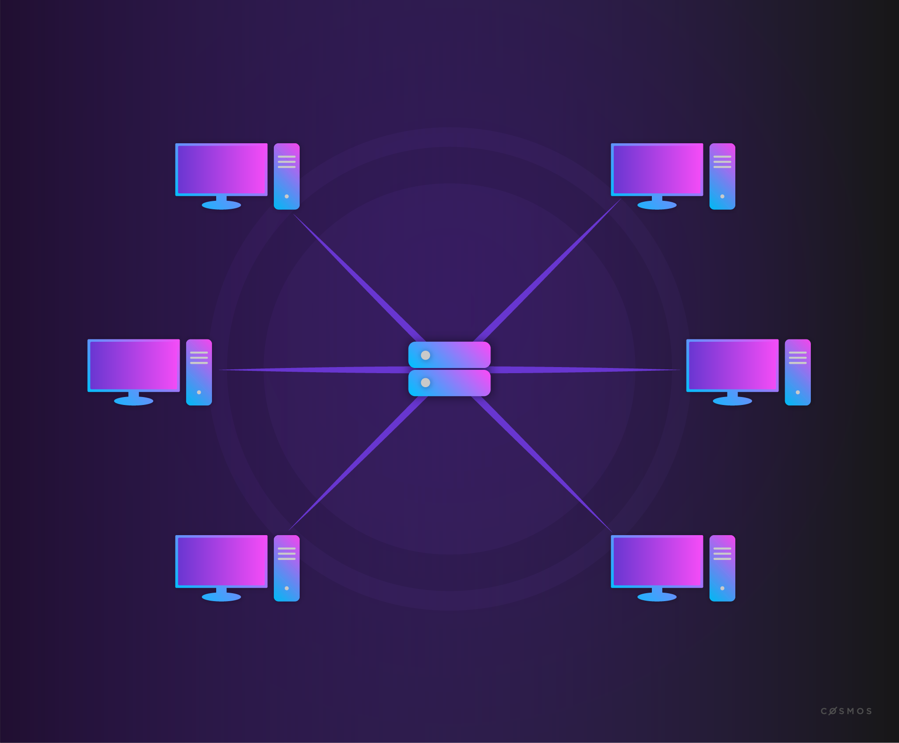
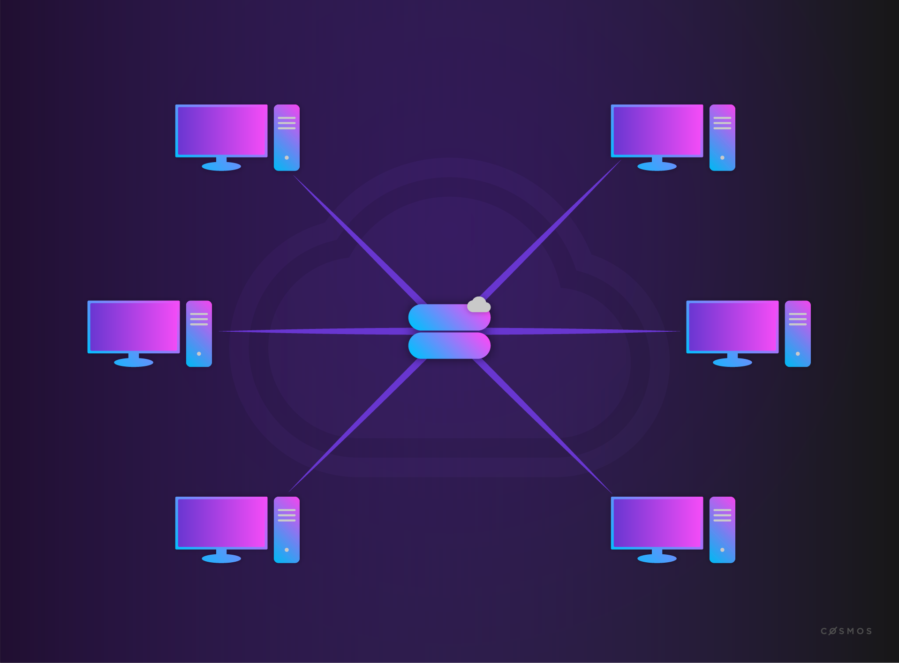
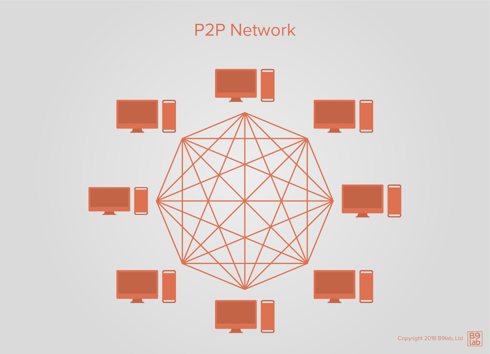
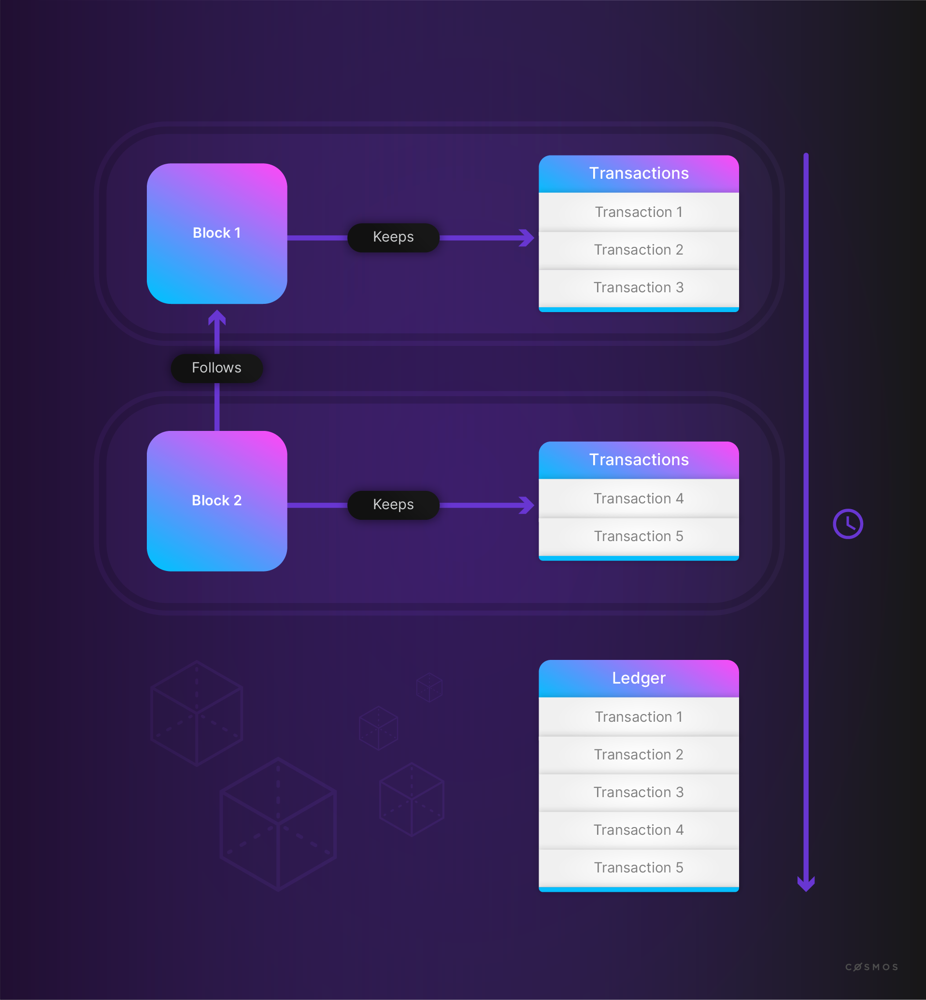
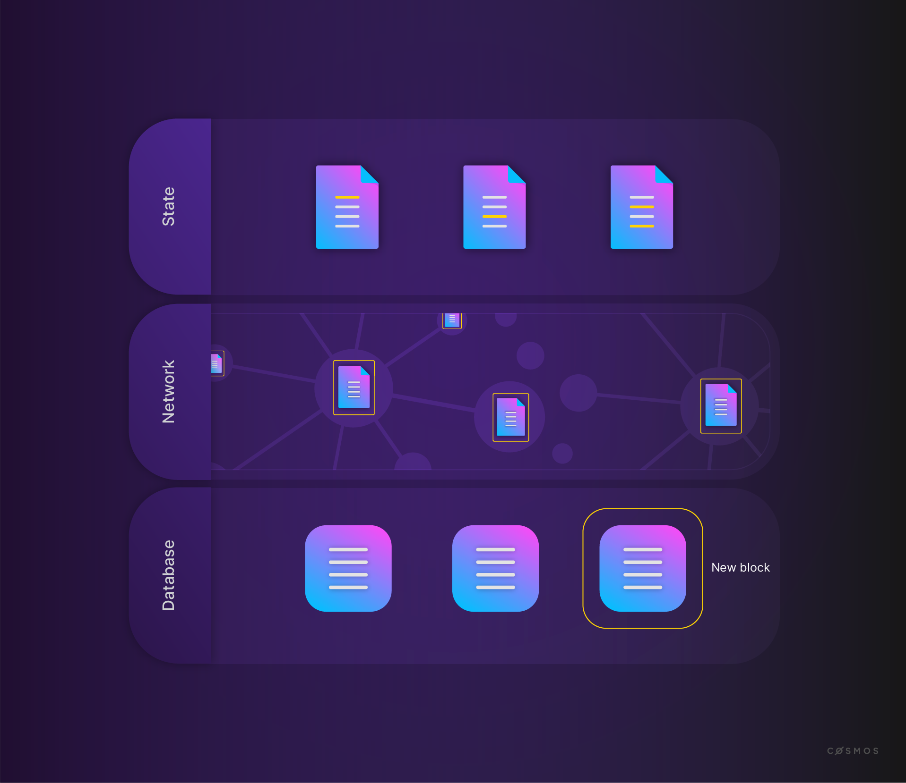

# Networks and Protocols

It is time to learn about networks. You will not go into too much depth, but a few concepts are relevant to understanding blockchain technology.

Let's begin with a few important terms in networking.

A **network** is _a group or system of interconnected computer systems and other computing hardware devices_. These are connected through communication channels between the different nodes or data links allowing them to exchange data and share resources, operating programs, and information.

In the following, you get to revisit the concept of data transfers and how protocols in networking can solve problems in a hierarchy-free, fault-prone environment when it comes to network failures.

<ExpansionPanel title="Some definitions of key terms in networking">

Start with some definitions to make this easier:

* **Data:** a series of one or more symbols given meaning by acts of interpretation;
* **Database:** an organized collection of data;
* **Data field:** holds a single attribute of an entity. For example, a date field "15th of October 2018" can be treated as a single data, the birthdate, or three separate fields, meaning day, month, and year;
* **Record:** a compilation of fields containing exactly one value. For instance, an employee record might contain fields like name, address, and birthdate;
* **File:** a collection of related records;
* **Network:** a group or system of interconnected computers and other hardware devices;
* **Node:** or members of a network, connected through communication channels that enable them to exchange data and share resources;
* **Protocol:** set of rules governing the exchange or transmission of data between devices;
* **Document:** a set of structured data that has a beginning and an end;
* **Client:** in a network, a client refers to a computer that is capable of obtaining information and applications from a server;
* **Server:** refers to a computer or computer program, which manages access to a centralized resource or service in a network.

</ExpansionPanel>

## Data transfer

The most basic attribute of a network is the ability to transfer data between computers. Let us briefly recall how that process works.

Imagine two computers that are connected and have access to two different databases:

1. Computer A sends a request for a set of information that is located on another computer.
2. Computer B accesses its database, querying for the data Computer A asked for.
3. Computer B retrieves the data and compiles a document.
4. Computer B sends the document to Computer A.
5. Computer A receives the document and interprets the data, perhaps storing it in its database or executing a series of actions.

In general, an encode-decode sequence happens on the two computers to **synchronize data between machines**. First, a sequence of characters is *encoded* in a specialized format, send, and then *decoded* by reversing the process. 

<HighlightBox type="info">

Common codes include the American Standard Code for Information (ASCII) for text files, Unicode, MIME, BinHex, and Uuencode, and in the context of data communications among others Manchester encoding.

</HighlightBox>

The role of **documents** is important to highlight here. What does a document transfer look like?

As an example, picture an **API request**.

<ExpansionPanel type="What is an API and an API request?">

The term **application programming interface (API)** describes _a connection between computers (and their software)_. You have probably heard the word API, more specifically web API, quite often when it comes to communication between computers via the internet. You can find APIs for software libraries and programming languages.

What is an API request?

With APIs, developers can make calls or requests to send and receive information. Such type of communication is often done using JSON, a programming language, and called an API request. Each API request has:

* An API endpoint - you can often find a URL for the endpoint to allow software to communicate with each other;
* A header providing information for clients and servers, for example, authentication credentials;
* A method, which specifies the action necessary for the request - four basic and often used API methods are `GET`, `PUT`, `POST`, and `DELETE`;
* Data, or information, send by a server specifying the request.

</ExpansionPanel>

1. A client sends a request to an API endpoint, along with attributes for the data requested - `GET https://example.com/inventory?id=2311`.
2. The server receives the request and queries its inventory database for the requested data - `SELECT * FROM inventory.products WHERE id=2311;`.
3. The server forms a JSON response from the data, the document  - `{"products": [2311: {"name": "Raw Linseed Oil"}]}`.
4. The server sends the document to the client, which is waiting for the response.
5. The client reads the document, attempts to parse it as JSON, and stores the information in a local database - `INSERT INTO favorites (ext_id, name)
VALUES (2311, "Raw Linseed Oil");`.

<ExpansionPanel title="JavaScript Object Notation (JSON)">

JSON is an open-standard, language-independent **data format**. Meaning it is a publicly-available standard for encoding information that is stored in a file and it is not limited to one programming language. It is used as a data format for browser-server communication. It uses human-readable text to transmit data objects.

JSON is based on JavaScript. It was developed as a response to the need for a protocol that could ensure server-to-browser communication without relying on browser plugins (like Java or Adobe Flash Player), i.e. software components which add new features to web browsers and are also referred to as "add-ons" or "extensions".

Other to JSON comparable formats are XML, CSV, and YAML.

</ExpansionPanel>

What are potential failures of an API request?

* The client could send a request that the server does not understand, or send a malformed request;
* The server could create a document that the client does not understand, for example, a server sends XML when the client expects JSON;
* The server could send a malformed document;
* Either party could send a malicious request, for example, SQL injection `GET https://example.com/inventory?id=2311%3BDROP%20TABLE%3B`.

In modern network systems and in fact, the web itself, a great deal of effort goes into mitigating these **translation and synchronization issues between clients and servers**. Traditionally, network synchronization issues were often mitigated by implementing some kind of hierarchy. Blockchain uses a **non-hierarchical approach** to mitigate synchronization issues by making sure that every participant always has access to enough data to verify the integrity of ALL the data in the network.

## Networking and protocols

Before diving into how these issues are approached with blockchain technology, revisit how protocols in networking solve problems inherent to a hierarchy-free, fault-prone environment.

The term **networking** covers both _the hardware side and the software protocols used to transmit data and let computers communicate_. The interaction between software and hardware becomes especially interesting in a blockchain context because of a networks' physical aspect.

Imagine a cable connection between two computers. Traditionally a coaxial cable was used to carry a signal. Cables can be subject to interference from many things, so there is no guarantee that the signal originating at point A will be received by point B.

To mitigate this problem and ensure smooth communication, a whole stack of hardware and software protocols has been developed. Remember, **protocols** are like behavior guidelines for machines that help them cooperate and understand each other, as well as mitigate any translation and synchronization issues.

As an example, think about what happens in **the case of missing data**.

To facilitate data transfer, protocols like TCP split data into small packets and transmit each one individually. These bits of data are converted into an analog signal on the hardware level. On the receiving end, the signals are reconstructed and the software protocol re-assembles the original piece of data. If a packet is missing, the receiving computer can ask for the **re-transmission** of the missing bundle of data.

<ExpansionPanel title="Fault tolerance">

**Fault tolerance** is _the capability of a computer, electronic system, or network to keep operating even when components fail_.

A **fault-tolerant design** requires:

* **No single point of failure** as a fault-tolerant system should continue operating uninterrupted while it is repaired;
* **Fault isolation and containment** as failures should not affect the entire system by being isolated and contained;
* **Reversion modes** should be available.

When learning about blockchain, it is worth understanding these fundamentals because the technology operates in a similarly uncertain environment. Blockchain is designed to be fault-tolerant, thereby minimizing potential disruption and damage in adverse conditions.

</ExpansionPanel>

## Centralized, distributed, and decentralized networks

The function of a network is largely defined by its **degree of centralization**. Generally, networks can be centralized, decentralized, or distributed.

You will see the term _decentralized_ come up a lot in blockchain literature. What exactly constitutes a distributed vs. decentralized system is a hotly debated subject. Complicating things further is the fact that systems can be a mix of both.

<ExpansionPanel title="Paul Baran's On Distributed Communications">

In 1964, before major discoveries and developments such as public-key cryptographic systems and P2P networking Paul Baran published a paper [On Distributed Communications](https://www.rand.org/content/dam/rand/pubs/research_memoranda/2006/RM3420.pdf). In it, Baran attempted to differentiate between diverse degrees of decentralization.

Centralization and decentralization were attributes introduced long before to describe political systems and power structures. In Baran’s conceptualization, a spectrum of network typologies exists. The main point of differentiation between the different typologies is the number of so-called **points of failure**. After Baran introduced his typology accompanied by developments in networks, databases, computing, and cryptography, a more detailed continuum of typologies was proposed. Among other aspects, the importance of resource and power control was emphasized.

</ExpansionPanel>

For the purpose of our discussion, we will focus on the main difference between the different types: the number of **points of failure**.

A **point of failure** can be understood as _a single node or part of a network whose failure leads to the shutdown or dysfunction of the entire network and/or the system no longer being able to perform its intended operations_. Centralized networks only have **one** point of failure. Erasing a point of failure leads to less centralization and towards a distributed network.

There were different network typologies proposed. Some view resource and power control as important aspects to differentiate networks. Still differentiating distributed and decentralized networks by the location and control of resources includes a linear spectrum notion of centralization in networks.

<HighlightBox type="tip">

Watch [Greg Slepak explain the concept of decentralization](https://www.youtube.com/watch?v=7S1IqaSLrq8) in 5 minutes. 

</HighlightBox>

Although the advantages and disadvantages of each type continue to be debated, to conclude: the network design has implications on functionality and more general issues, for example, privacy and transparency. It is important to keep in mind, a network does not have to be centralized, decentralized, or distributed - it can be a mix of different components of each type. The network design should always match the envisioned functionality of the network.

### Peer-to-peer (P2P) networking

A **peer-to-peer (P2P) network** has a **distributed architecture**, meaning that work is distributed among members of the network. P2P networks are usually composed of computer systems as peers and connect via the internet. Each participant, called a node, connects to a limited number of other nodes, which are commonly referred to as its **peers**. Peers make resources like computing power and network bandwidth available to all peers in the network.

All participants are equal in that they can all request information and answer requests. Understood as equality is that all participants are **equally privileged and equipotent**. For this reason, P2P networking has been seen as a means for an egalitarian social network.

P2P networks are highly different from client-server networks, in which the data supplier and consumer roles are ascribed to different entities and all communication happens through a central server. In a traditional client-server architecture, participants are either a client, which requests information, or a server, which answers those requests - remember the API request, that is a classic client-server example. Centralized security databases that restrict control to server assets help improve security. Client-server networks are suitable for large networks but can become expensive when handling large amounts of data, transfers, and clients.

 

In P2P networking there is no central server, storage, or authentication of users. Peers can be understood as file servers and clients at the same time. If a node cannot answer a request, it will forward it to some or all of its known peers.

P2P networks became popular in file-sharing applications like Napster and BitTorrent, which are typically associated with illegal music downloading and piracy. P2P networks are usually recommended for private households or small businesses - they are economically speaking **cheap to set up**, but **security issues** can create expensive problems.

Security is challenging in P2P networking for two reasons:

* P2P software has to be **downloaded** to become part of the network, making it especially vulnerable to remote exploits. 
* Every peer has an equal network connection because of **interconnectivity**, a malicious participant could send incorrect requests or returns, as well as malware and corrupted data through the entire network. Other security risks are denial of service (DDoS) attacks, routing attacks, and routing network partitions.

Hashing, chunk verification, and a higher degree of encryption are means to mitigate security risks in P2P networks.

Are P2P networks decentralized, distributed, or centralized networks?

P2P networks can be decentralized, distributed, centralized, or a mix. When a system has different components, which combine P2P elements with other networking concepts, it can at the same time have parts typically known as distributed and include centralized aspects.

Remember the two P2P services we mentioned earlier, Napster and BitTorrent? They include aspects typically ascribed to distributed and centralized networks.

**Napster** is a music-focused file-sharing service. Its earliest version used **distributed data storage**, since music files were distributed through peers and not stored on a central database. However, a **central server** was used to manage the peers. Napster combined a distributed P2P data storage with a central managing authority, the Napster server. After the Recording Industry Association of America (RIAA) sued Napster for facilitating the sharing and transfer of copyrighted material, Napster shut down its original P2P network in July 2001.

**BitTorrent** is another P2P file-sharing service that is also used to share music. Like Napster, BitTorrent uses a **data storage among peers**. However, it has a **decentralized network structure** since there is no central server. BitTorrent also faced legal complaints due to allegedly facilitating copyright infringement through illegal downloading. But this time, the case was not so clear as with Napster. Why?

Because of BitTorrent’s decentralized coordination of peers: there was no central server that could be turned off to shut down the network.

These two examples show how **network design and structure** choices can have far-reaching impacts. Knowing how P2P networks work is essential in understanding blockchain technology. Just think about the similarities between P2P network architecture and the network structure of blockchain applications.

## Blockchain as a merge of data storage and network

Historically, data storage and networks have been **treated separately**, mainly because the former was adopted long before the latter. Networks were built first, and data storage was connected afterward.

Blockchain merges these two concepts by combining elements of a database with a P2P network. Blockchains store data in the same way as a **decentralized database**, and also use P2P networking.

As the name suggests, a blockchain can be thought of as a chain of blocks. The blocks are ordered in a sequence and back-linked, which means each block is linked to its preceding block. A blockchain can be understood as a **data structure** since it has a certain manner of storing and organizing data, but at the same time, it is also more than a database. Part of the reason is that a blockchain collects data values or attributes, but it also includes their relationships and enables a set of possible functions and operations.

If we imagine blockchain as a computer, it would have three layers: **database**, **network**, and **state**. The entire computer is a collection of blocks where every new block represents an update to the state layer. 

<!-- Include video: Title: How does Blockchain Actually Work?, URL:https://www.youtube.com/watch?v=Za5lPKNV_Mk&feature=youtu.be -->

All **data**, such as currency transfers or smart contract code or calls of function, is encoded in **transactions**, which are bundled into blocks and must be validated. Remember, data cannot be deleted or altered after being stored on a blockchain.

The blockchain network layer is comprised of **nodes**. Each node has a copy of the chain of blocks. Nodes are usually given equal power, but power distribution depends on the deployment pattern of the blockchain.

Currency transfers and smart contract implementation is done by adding transactions to the blockchain, which will again be bundled into a block and verified. To interact with the state layer of the blockchain computer, a user can send transactions or view information by coupling an application with a node. Smart contracts can then be used to interact with transactions.

## Quick recap

<HighlightBox type="reading">

* [Baran, Paul (1964): On Distributed Communications](https://www.rand.org/content/dam/rand/pubs/research_memoranda/2006/RM3420.pdf)
* [Slepak, Greg (2015): Deconfusing Decentralization - a very good introductory video on the concept pf decentralisation](https://www.youtube.com/watch?v=7S1IqaSLrq8)

</HighlightBox>

## Next up
